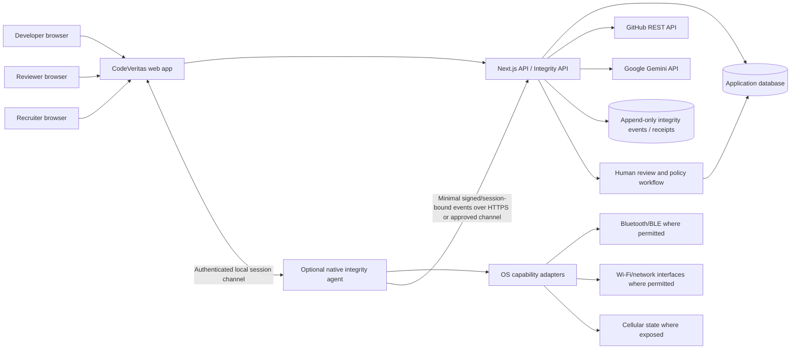

# CodeVeritas — Proposed Whole-Project Solution

**Document type:** Proposed product and technical solution  
**Project:** CodeVeritas — evidence-backed developer credentials  
**Team:** Code Breakers · **Team ID:** `TEAM-CB001`  
**College:** Maharaja Institute of Technology Mysore  
**Team members:** Bhavish S, Vishesh G Devanur, Varshith V, Yashavanth B N (all 3rd year)  
**Status:** Proposal for planning and review. Existing CodeVeritas features and the proposed Proximity Sentinel are explicitly distinguished below.

> This file proposes the solution for the whole project, not a video script. The attached Proximity Sentinel brief is treated as a proposed future subsystem. This document does not implement or authorize application changes. No proximity monitoring, native agent, new APIs, schema, dashboards, tests, or policies should be represented as already available unless separately built and verified.

## 1. Executive summary

CodeVeritas is a web platform for producing reviewable evidence of practical software-engineering skills. Recruiters define role-oriented challenges; developers submit public repositories and may complete configured recorded-work, repository-quiz, and speaking assessments; independent reviewers apply a shared rubric; recruiters inspect verified credentials through candidate profiles and CodePassports.

The proposed solution keeps the existing evidence workflow as the product foundation and treats AI as assistance rather than an authority. A credential remains provisional until required evidence and two independent reviews are present. GitHub activity is context, not proof of authorship. No automated score is presented as proof of identity, cheating, code authorship, or future job performance.

The attached **Proximity Sentinel** concept is proposed as an optional, separately consented environmental evidence subsystem. It would use a native agent for OS-level wireless/network observations, classify noisy readings into configurable estimated buckets, preserve a verifiable event history, and surface evidence for human review. It must not claim exact distance from ordinary RSSI or automatically disqualify a candidate. Feasibility, privacy, security, OS permissions, calibration, and false-positive testing are gates before any pilot.

## 2. Problem, users, and intended outcomes

### Problem

Hiring teams often need to infer engineering skill from self-reported profiles, isolated project links, and interviews. Candidates need to show work with context; reviewers need a consistent process; recruiters need evidence they can inspect and compare.

### Users

| User | Current need | Proposed outcome |
|---|---|---|
| Developer / candidate | Demonstrate challenge work and understand assessment status | A clear submission journey and shareable CodePassport based on recorded evidence |
| Independent reviewer | Assess work consistently and avoid relying on a single opinion | Review queue, common rubric, source evidence, conflict/duplicate protections, and clear pending states |
| Recruiter | Find and compare developers for a role | Role-specific challenge setup, discovery, score context, profiles, and interview invitations |
| Assessment administrator | Configure roles, policies, supported capabilities, and safe operations | Auditable configuration and explicit provider/device capability status |

### Outcomes to target

- Make assessment evidence traceable to a developer, challenge, repository revision, and applicable assessment attempt.
- Keep status and score meanings understandable, including pending and provisional cases.
- Require human review for consequential credential verification.
- Support consent, privacy, correction, and review of integrity observations.
- Make failures visible and recoverable instead of presenting fabricated success.

No employment-outcome prediction, fairness improvement, or fraud reduction is claimed without evaluation data.

## 3. Scope and implementation status

### Documented in the current repository

The repository describes a Next.js web application with role-specific dashboards, public GitHub repository submissions, configured Gemini analysis and assessment generation, optional timed recording, PRI quiz and speaking assessment stages, reviewer rubric submissions, recruiter candidate discovery, and CodePassport views. Two distinct reviewers are required for verification. The current schema uses Prisma with SQLite for local configuration.

The current application requires network connectivity for authentication, API/database operations, GitHub, Gemini, and assessment actions. Session recording writes to local storage in development. The codebase documents a PostgreSQL migration metadata mismatch, so the production database configuration needs reconciliation. The repo does not claim an established production deployment.

### Proposed, not currently documented as implemented

- Proximity Sentinel and native integrity agent.
- OS-level Bluetooth/BLE/Wi-Fi/cellular scans and network-interface monitoring.
- RSSI calibration, smoothing, proximity buckets, environmental baseline/drift, and cross-event correlation.
- Hash-chained integrity event log and sealed receipt for Sentinel observations.
- Sentinel candidate/reviewer dashboards, capability matrix, and event simulator.
- Durable production recording storage, production deployment, platform security review, and load-tested service capacity.

Any demo or submission must keep these two lists separate.

## 4. Proposed end-to-end product workflow

### 4.1 Challenge setup

1. Recruiter creates a challenge with target role, difficulty, description, requirements, session duration, and PRI configuration.
2. Recruiter previews questions, assessment requirements, privacy notices, scoring weights, and review rubric.
3. Challenge is published only after required configuration is valid.

### 4.2 Developer participation

1. Developer reviews challenge requirements, data use, recording consent, monitoring capabilities, and network requirements before starting.
2. Developer submits a public GitHub repository. The workflow stores the repository URL and, where supported by the current implementation, the pinned revision/commit evidence.
3. The app collects repository metadata through GitHub and runs configured analysis. A timed recording is optional/configured by challenge; consent and upload status are explicit.
4. Developer completes configured PRI quiz and speaking stages. Each stage has its own start, completion, failure, and retry state.
5. The developer sees saved, pending, failed/retry, provisional, or complete states. No missing score is silently converted to zero or described as a failure of ability.

### 4.3 Reviewer verification

1. Reviewer sees submissions permitted by their role and assignment policy.
2. Reviewer inspects challenge context, repository evidence, recorded assessment evidence where permitted, and AI-generated analysis with its limitations.
3. Reviewer submits the shared rubric once per credential. The data model prevents the same reviewer from submitting duplicate scores for that credential.
4. A second distinct reviewer independently submits a review.
5. Credential verification and verified PRI presentation are updated only according to the implemented policy. Conflicts, missing data, and disagreement require a documented handling policy.

### 4.4 Recruiter discovery and CodePassport

1. Recruiter searches candidate profiles and filters using supported fields.
2. Recruiter opens a profile/CodePassport to inspect verified credentials, challenge context, available scores, and repository evidence.
3. Candidate comparison communicates score coverage and provisional status; missing assessments are not treated as zero.
4. Recruiter may invite a candidate to an interview through the supported flow.

### 4.5 Optional future Sentinel workflow

If approved and implemented later, Sentinel would be an optional, explicitly disclosed assessment-integrity signal flow:

1. Candidate receives a plain-language notice describing data, purpose, access, retention, permissions, and alternatives/appeal.
2. Native agent reports OS/platform capabilities and permissions before monitoring starts.
3. With consent and valid capability status, agent records a minimal environment baseline and starts timestamped observations.
4. Signal processing labels estimates with uncertainty and records changes; it does not infer exact distance or intent.
5. The policy engine emits a notice/warning/manual-review case according to published rules. It does not automatically fail/disqualify solely for nearby devices or an RSSI bucket.
6. Reviewer inspects the timeline and source/capability limitations; candidate can see the relevant notice and challenge/correct a result.
7. Session is sealed, verified, retained/deleted according to policy, and its integrity receipt can be checked.

Sentinel must not alter existing recording, AI, computer-vision, quiz, PRI, or reviewer workflow without a separate design and approval.

## 5. Functional requirements

### 5.1 Existing-platform requirements to preserve

- Authentication, role selection/access control, registration, session management, redirects, and error handling.
- Challenge creation/configuration and role-specific visibility.
- Repository submission, validation, evidence collection, and actual retry behavior.
- Assessment consent, recording, quiz, speaking, and scoring rules as implemented.
- Reviewer independence, shared rubric, duplicate protection, and verification state transitions.
- Candidate search, CodePassport privacy boundaries, comparison, and interview invitations.
- Existing AI and computer-vision behavior and disclosures.

This proposal does not redefine or direct changes to these flows.

### 5.2 Future Sentinel requirements

- Explicit opt-in and notice before observation; visible monitoring state and stop/help path.
- Native agent installation, authenticated pairing, session binding, and start/stop lifecycle.
- Capability results for every OS/radio module: `SUPPORTED`, `UNSUPPORTED`, `PERMISSION_DENIED`, `RESTRICTED`, or `ERROR`.
- Minimal Bluetooth, Wi-Fi, cellular-state, and network-interface observations where legally and technically permitted.
- Pseudonymous stable identifiers; raw MAC addresses are not exposed to recruiters.
- RSSI filtering, calibration by device/radio/environment, estimated proximity buckets, and an honest unknown state.
- Immutable baseline reference and event timeline with clear real/simulated labeling.
- Correlation and policy levels with explanation and human review; no automatic cheating verdict.
- Append-only integrity log, event authentication, replay/duplicate protection, seal, and verifiable receipt.
- Candidate and reviewer UI that exposes capability limits and does not visualize false precision.
- Retention/deletion, access auditing, incident handling, correction, and appeal policy.

## 6. Proposed system architecture

### 6.1 Current architecture baseline

The documented system uses browser clients, a Next.js web app/API, Prisma persistence, GitHub REST API, Google Gemini API, scoring/credential workflows, and development-local session recording storage. Current code locations and request walkthrough are described in `docs/architecture.md`.

### 6.2 Future target architecture with Sentinel

This diagram is a target proposal, not the current deployed architecture. The preferred native stack in the supplied brief is Tauri, Rust, TypeScript/React, WebSocket, and HTTPS. Final transport, signing, pairing, and storage design require threat modeling. A local WebSocket must be authenticated and protected against origin abuse, replay, and cross-session injection; HTTPS protects the backend path but does not itself prove sensor truth.

### 6.3 System boundaries and trust assumptions

- Browser and native agent are candidate-controlled endpoints and can be compromised or misconfigured.
- OS APIs and radio hardware provide imperfect, platform-dependent signals.
- GitHub and Gemini are external services subject to permissions, availability, quotas, and changing behavior.
- Application backend validates identity/role/session binding, persists evidence, and enforces policy; it cannot prove physical truth from RSSI alone.
- Human reviewers make credential decisions within a rubric, but can still be biased or collude; two reviews reduce single-review dependence, not all risk.
- Hash chains make tampering detectable only when canonicalization, authentication, storage, and verification are correctly implemented; they do not make an event intrinsically true.

## 7. Sentinel observation and signal design

### 7.1 Bluetooth/BLE

For supported OS/radio/permission combinations, proposed observations include session/event ID, timestamp, pseudonymous device hash, RSSI, optional justified manufacturer data, and first-/last-seen timestamps. Windows proposal: `BluetoothLEAdvertisementWatcher`. Other OS adapters are conditional on APIs and permissions. Do not collect or display raw MAC addresses to recruiters.

### 7.2 Wi-Fi

Where permitted, observe network changes, connection status, RSSI, frequency/channel, first/last seen, and a minimized/hash identifier. Collect SSID/BSSID only when necessary and approved. Signal strength is not exact distance.

### 7.3 Cellular and interfaces

Report only OS-visible states: unavailable, present but inactive, active, or unknown; and network-interface/route changes such as connected, disconnected, changed, added, or removed. Do not claim cellular towers identify or locate nearby phones.

### 7.4 RSSI processing and estimated buckets

Use multiple samples, rolling windows, medians, optional mode, exponential smoothing, and outlier rejection. A single sample must never determine a bucket. Proposed configurable labels from the supplied brief:

| Reference concept | Bucket |
|---|---|
| 0–1 m | `VERY_CLOSE` |
| 1–3 m | `CLOSE` |
| 3–5 m | `NEAR` |
| 5 m+ | `FAR_OR_UNKNOWN` |

These are calibration-oriented concepts, not guaranteed measurements. UI text must say “estimated proximity” and preferably show bucket, smoothed RSSI, sample count, calibration profile, and confidence/quality explanation. Return `UNKNOWN` when there is insufficient evidence. Avoid numeric confidence percentages until calibrated and validated; if exposed, explain that it is a model/configuration confidence, not probability of cheating or exact distance.

Calibration profiles should be device/radio/environment-specific and contain profile ID, model, radio type, environment, reference observation(s), calibration date, and protocol/version. Calibration must be reproducible and administrators must be able to invalidate stale profiles.

### 7.5 Temporal evidence and environmental drift

Persistence can improve the stability of a signal estimate, but does not establish physical identity or misconduct. Configurable temporal windows may distinguish one-off, recurring, and sustained observations. The brief’s example cadence (one sample low, ten over 30 seconds medium, thirty stable over 90 seconds high) is a starting hypothesis only; test and tune it before use.

Compare current observation summaries with an immutable session baseline. Candidate events include new observation, transient observation, disappearance, network change, and adapter change. Keep the original baseline hash and source records so later summaries can be recomputed and reviewed.

### 7.6 Correlation

Correlate only approved events within a bounded time window. Each correlation should reference source event IDs, window, algorithm/configuration version, capability state, confidence/quality, risk category, and a plain-language explanation. Example: “A new wireless observation persisted during a network transition.” Never translate an event into “candidate cheated.”

## 8. Data model proposal

The current Prisma schema is SQLite-oriented and is not changed by this proposal. Any Sentinel schema additions require migration review, retention design, access-control review, and database-provider reconciliation.

### 8.1 Conceptual entities

| Entity | Purpose | Example fields (proposal only) |
|---|---|---|
| `IntegrityAgent` | Registered native agent/device and pairing state | agent ID, user/device pseudonym, OS/build, public key reference, status, created/revoked timestamps |
| `IntegritySession` | Sentinel monitoring lifecycle bound to a challenge/credential | session ID, credential/session reference, consent version/time, agent ID, capability snapshot, baseline hash, started/sealed times, status |
| `IntegrityCapability` | One OS module’s support/permission result | session ID, module, status enum, adapter/version, reason code, checked time |
| `IntegrityEvent` | Append-only raw/minimized observation or agent event | event ID, session ID, event type, monotonic/UTC time, pseudonymous subject hash, minimized payload, payload hash, previous hash, current hash, source/version |
| `ProximityCalibration` | Admin-approved calibration profile | profile ID, device/radio/environment, method/version, reference samples, validity, calibrator, timestamps |
| `IntegrityCorrelation` | Derived human-readable event group | correlation ID, session ID, event IDs, algorithm version, time window, quality/confidence, risk category, explanation |
| `IntegrityPolicy` | Versioned assessment-specific handling rules | policy ID/version, warning toggles, thresholds, required agent/capability, action by level, effective dates |
| `IntegrityReceipt` | Sealed session verification summary | session ID, event count, first/final hashes, algorithm version, sealed time, verifier status |
| `IntegrityReview` | Human response/appeal disposition | reviewer, session/correlation, decision, rationale, candidate response, timestamps |

Do not duplicate sensitive raw identifiers into candidate profile views. Separate short-lived raw observations from derived summaries where feasible; record deletion and legal hold behavior explicitly.

### 8.2 Event chain

Conceptually, each event hash is `SHA-256(previousEventHash || canonicalEventPayload)`. Define canonical serialization, encoding, event order, timestamp treatment, key binding, concurrency behavior, and versioning. Verify the chain server-side at ingestion and session seal. Include authenticated agent/session binding and replay protection. A chain without trustworthy authenticated input and protected storage is insufficient.

## 9. API and protocol proposal

These are design candidates, not current endpoints. Final routes and payloads require authentication/authorization and API design review.

| Operation | Proposed behavior |
|---|---|
| `POST /api/integrity/agents/pair` | Pair/authorize an agent with a short-lived one-time challenge and user confirmation |
| `GET /api/integrity/sessions/:id/capabilities` | Return explicit OS/radio capability states for a session |
| `POST /api/integrity/sessions/:id/start` | Verify consent, policy, challenge binding, agent, and capability snapshot; accept baseline |
| `POST /api/integrity/sessions/:id/events` | Ingest authenticated, bounded, deduplicated, session-bound observations; validate sequence/hash |
| `POST /api/integrity/sessions/:id/heartbeat` | Report agent presence and session liveness without implying sensors are available |
| `POST /api/integrity/sessions/:id/seal` | Stop collection, verify chain, create integrity receipt, and return seal status |
| `GET /api/integrity/sessions/:id/timeline` | Return only role-authorized, privacy-minimized events and explanations |
| `POST /api/integrity/correlations/:id/reviews` | Record authorized human review and disposition |
| `POST /api/integrity/sessions/:id/appeals` | Allow candidate response/request for human review under published policy |

Protocol requirements: TLS for backend transport, short-lived scoped credentials, strong agent pairing, least-privilege authorization, rate/size bounds, idempotency keys, replay rejection, schema versioning, audit logs, and explicit retention. Avoid placing stable raw hardware identifiers in URLs/logs.

## 10. Policy, UI, and accessibility proposal

### Candidate UI

- Pre-session plain-language explanation and versioned consent.
- OS/radio capability checklist with reason for unavailable/denied/restricted state.
- Visible monitoring, connection, baseline, and upload/seal status.
- Estimated buckets with uncertainty; no exact-distance graphic.
- Warning/help/pause/stop flow consistent with published assessment rules.
- Access to applicable events and a way to report a false positive or request review.

### Reviewer UI

- Timeline with source timestamps, event type, capability/permission state, and provenance.
- Baseline/current summary and abstract zone visualization, with no GPS-like coordinates or false precision.
- Clear distinctions between observed events, derived correlations, and simulated demo data.
- Policy version, data quality, calibration age, provider/agent errors, and reviewer action history.
- Human disposition choices and rationale; do not provide a one-click “cheating” verdict.

### Administrator UI

- Platform capability matrix and health status.
- Versioned calibration and integrity policy configuration with audit trail.
- Retention, deletion, access, and incident controls.
- Threshold previews and controlled calibration records.

Use keyboard-accessible controls, readable text, non-color status labels, and an accessible explanation of why an unavailable capability is not a candidate fault.

## 11. Security, privacy, and fairness requirements

Before implementation or pilot:

1. Complete a threat model covering compromised endpoints, malicious agent, browser-origin abuse, local channel pairing, event forgery/replay, clock manipulation, backend authorization, reviewer access, and data leakage.
2. Collect only assessment-relevant data. Do not secretly capture microphone, arbitrary files, passwords, or unrelated application content.
3. Explain permissions and collection before start; bind consent to a notice/version and session.
4. Hash/pseudonymize identifiers using a reviewed rotation/linkability strategy. Hashing alone is not anonymization if the value is linkable.
5. Encrypt transport and sensitive storage; manage keys and access with least privilege.
6. Define retention/deletion timelines for raw readings, derived events, recordings, and receipts. Provide deletion evidence and access auditing.
7. Define incident response, candidate correction/appeal, reviewer guidance, and administrator oversight.
8. Evaluate false positives from ordinary peripherals, shared rooms, radio interference, adapter behavior, and varied hardware/OS versions.
9. Provide an alternative process when a device cannot support a capability or a candidate cannot grant permission; do not silently treat unsupported as suspicious.
10. Do not auto-disqualify based solely on device presence, signal bucket, cellular state, or network changes.

## 12. Failure handling and operational behavior

| Failure | Required proposed behavior |
|---|---|
| Bluetooth/Wi-Fi module unsupported | Mark `UNSUPPORTED`; do not fabricate observations; apply published alternative policy |
| Permission denied/restricted | Explain how to proceed; record capability state, not a misconduct flag |
| Agent disconnect | Mark telemetry gap and exact time; attempt bounded reconnect; no silent continuity claim |
| Network unavailable | Clearly show backend ingestion unavailable; preserve only authenticated local queue if a separately reviewed design supports it; otherwise explain that data was not uploaded |
| Duplicate/replayed event | Idempotently reject/dedupe and log security-relevant rejection without duplicate scoring |
| Invalid hash chain/signature | Do not seal as valid; preserve diagnostic evidence; route to manual review |
| Calibration missing/stale | Return unknown/low-quality bucket; do not produce exact range |
| AI/GitHub failure in existing app | Preserve actual pending/retry behavior; do not conflate with Sentinel or invent success |
| Simulated demo event | Visibly label `SIMULATED`; prevent it from being stored as real assessment evidence |

## 13. Testing and acceptance strategy

No implementation tests are run or added as part of this proposal. If development is approved, create a test strategy before code changes.

### Unit tests

- RSSI windows: stable, fluctuating, sparse, outlier, invalid, and non-monotonic timestamps.
- Calibration: missing, stale, wrong device/radio, environment mismatch, and version changes.
- Bucket boundaries and `UNKNOWN` behavior.
- Temporal evidence: transient vs persistent observations and explainable confidence levels.
- Canonical event serialization, hash calculation, chain order, duplicate/idempotent handling, seal and verification.
- Policy mapping for each configured level; unsupported/permission failure is not disqualification.
- Privacy transforms ensure raw MAC/BSSID are not exposed in recruiter-facing serialization.

### Adapter/integration tests

- Bluetooth unavailable, permission denied, device appears/disappears.
- Wi-Fi unavailable/change and network interface/route changes.
- Cellular unavailable, present inactive, active, and unknown.
- Agent pairing, session binding, disconnect/reconnect, forged event, replay, and revocation.
- Backend authentication, authorization, rate/size limits, event persistence, seal, receipt verification, deletion/retention.
- Browser/agent mismatch, unsupported OS, driver/API error, and CDN/provider dependency.

### Field evaluation

- Controlled measurements across representative adapters, device models, room layouts, orientation, body obstruction, interference, and ordinary Bluetooth peripherals.
- Estimate false alerts, missed changes, unavailable rates, calibration effort, and candidate/reviewer comprehension.
- Have independent reviewers judge anonymized examples and measure disagreement; do not tune policy solely to increase flags.
- Publish limitations and do not turn unvalidated confidence into probability of misconduct.

### Acceptance criteria for any future release

- No single RSSI sample creates a proximity classification.
- UI consistently says estimated proximity and never invents exact meters from RSSI.
- Unsupported, denied, restricted, and error states are explicit and test-covered.
- Candidate notice/consent, monitoring indicator, retention, and appeal path are reviewed.
- Integrity chain verifies tampering but does not claim the observation itself is proven true.
- Reviewer sees evidence and explanation; system never asserts “candidate cheated.”
- Simulated events cannot be mistaken for real ones or affect real candidate scoring.
- Security/privacy review and limited pilot decision are documented before expansion.

## 14. Delivery roadmap

| Phase | Work | Deliverable / decision gate |
|---|---|---|
| 0. Current product baseline | Confirm current app flows, provider behavior, database target, recording storage, current docs and deployments | Agreed as-built inventory; no Sentinel assumed |
| 1. Sentinel feasibility | OS API/permission research, threat model, privacy/data inventory, legal/policy review, candidate alternatives | Written go/no-go and supported platform scope |
| 2. Agent prototype | Tauri/Rust process, secure pairing, lifecycle, capability reporting only | Explicit support/error states, no covert scanning |
| 3. Read-only adapters | One OS at a time for permitted BLE/network observations; pseudonymous event stream | Real-device adapter validation and privacy review |
| 4. Estimation | Filtering, calibration profiles, buckets, baseline, drift | Reproducible calibration protocol and false-positive results |
| 5. Integrity backend | Authenticated event ingestion, dedupe/replay defenses, append-only hash chain and receipt | Independent chain verification and threat tests |
| 6. Human workflow | Candidate notice/status, reviewer timeline/correlation, appeal and policy audit | Usability and fairness review; no automatic punitive action |
| 7. Simulator | Isolated demo mode with obvious synthetic label | Verified separation from real assessment records |
| 8. Controlled pilot | Opt-in small pilot on supported configurations | Published evaluation, incident review, retention verification, go/no-go |
| 9. Production readiness | Durable storage, deployment, monitoring, support, database reconciliation, operational controls | Security/reliability sign-off and documented service boundaries |

Dependencies: OS API access and signing/distribution, consent and policy design, secure key management, database provider decision, private durable recording storage, reviewer operations, and measured provider costs. Do not start a broad multi-platform build before the feasibility gate.

## 15. Risks and mitigations

| Risk | Why it matters | Proposed mitigation |
|---|---|---|
| RSSI treated as exact distance | Radio strength varies with chipset, environment, orientation, interference | Use buckets, calibration, multiple samples, unknown state, explicit uncertainty |
| False positive becomes misconduct claim | Ordinary devices and network changes are common | Evidence-only labels, transparent policy, human review, candidate appeal, no auto-disqualification |
| OS APIs differ or are restricted | Feature parity is not guaranteed across Windows/macOS/Linux | Capability matrix, adapter abstraction, supported-version testing, graceful unavailable state |
| Agent compromised or events forged | Endpoint is not a trusted sensor | Pairing, signed/session-bound events, replay protection, threat model, no claim of physical truth |
| Hash chain overstated | Hashes show tamper evidence, not observation authenticity | Authenticate source, protect keys/storage, explain chain limitations |
| Overcollection or linkage | Wireless identifiers can reveal behavior and be linkable | Data minimization, keyed pseudonyms/rotation, short retention, access audit |
| Existing product has provider failures | GitHub/Gemini outages can leave incomplete analysis | Preserve pending/retry behavior and display provenance/status |
| Recording storage risk | Local development storage is not production-grade | Private durable object store, resumable uploads, access controls, deletion and retention policy before production |
| Database configuration mismatch | SQLite schema vs PostgreSQL migration metadata can undermine deployment | Select one target, regenerate/validate migrations, rehearse backup/restore |
| Reviewer bottleneck or inconsistency | Two reviewers increase trust effort but consume capacity | Workload-aware queues, rubric calibration, monitoring reviewer disagreement |
| Demo simulation leaks into evidence | Synthetic records could affect candidate assessment | Separate simulator tenant/data path and immutable SIMULATED flag; test isolation |

## 16. Success measures (proposed, not measured)

Measure these before making effectiveness claims:

- Submission completion and recoverable failure rates by stage.
- Time from submission to first and second independent review.
- Reviewer agreement and rubric completion quality.
- Percentage of score dimensions with available evidence and clear provenance.
- GitHub/Gemini failure, latency, quota, and retry rates.
- Candidate understanding of consent, provisional status, and data use.
- Sentinel capability availability by OS/radio, event ingestion gaps, calibration stability, false-positive/missed-change rates, and appeal outcomes.
- Data retention/deletion completion and unauthorized access incidents.
- Load, storage growth, recovery, and backup/restore measurements.

Targets should be set only after a baseline study; do not invent launch KPIs or represent estimates as results.

## 17. Decisions required before implementation

1. Is Proximity Sentinel in scope for this submission or only future roadmap? Current recommendation: future proposal; do not include in current feature claims.
2. Which OS and hardware configurations can be supported in an initial pilot?
3. Is Sentinel optional, and what equivalent assessment path exists for unsupported devices or denied permissions?
4. What exact data is retained, for how long, by whom, and how can a candidate appeal or delete it?
5. Who can provision calibration profiles and approve policy thresholds?
6. What agent authentication/signing and pairing model is acceptable?
7. Which database is the production target, and how will migration metadata be reconciled?
8. What private object storage and consent/retention controls are required for recordings?
9. What is the operational reviewer capacity for two-review verification?
10. What independent security, privacy, fairness, and accessibility reviews are required before pilot?

## 18. Source-of-truth and team verification checklist

- [ ] Verify current features against the running application and code before presenting them as implemented.
- [ ] Verify current endpoint paths and source files before citing them in a demo.
- [ ] Confirm local URL/port: `resource.md` and README currently differ (`3001` vs `3000`).
- [ ] Reconcile the SQLite Prisma schema with the checked-in PostgreSQL migration metadata before deployment claims.
- [ ] Complete `ai.md` placeholders with all team members’ actual development tools and review actions.
- [ ] Read the final `TEAM-CB001_decision-log.pdf` before making claims about accepted trade-offs or scale calculations.
- [ ] Keep passwords, API keys, private recordings, and candidate answers out of repository and demo.
- [ ] Mark Proximity Sentinel and every section derived from its brief as **proposed** until implemented, tested, and approved.
- [ ] Keep simulated Sentinel data separate from real assessment evidence.
- [ ] Revisit privacy/security review if data fields, sensors, retention, or risk policy change.

## 19. Repository references

- `README.md` — current product definition, users, workflow, setup, limitations, and team.
- `docs/architecture.md` — current architecture, data model, APIs, and request walkthrough.
- `docs/constraints.md` — evidence limitations, integrity constraints, invalid input, and offline behavior.
- `docs/limitations.md` — current gaps, scaling risks, and roadmap.
- `ai.md` — development/runtime AI use, human review, and claims the product does not make.
- `prisma/schema.prisma` — current data model; not extended by this proposal.
- `resource.md` — HackMysuru submission details, artifacts, local demo notes, and reviewer path.
- `resource-templates/video-guide.md` — video requirements (reference only; this proposal is not a video script).
- `TEAM-CB001_decision-log.pdf` — submitted decision-log artifact; consult it for exact recorded decisions.
- User-provided Proximity Sentinel brief — proposed subsystem requirements captured in Section 6 and following.
