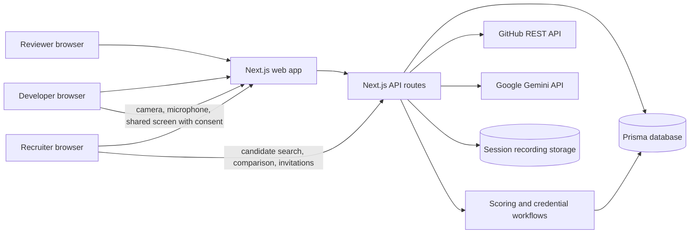
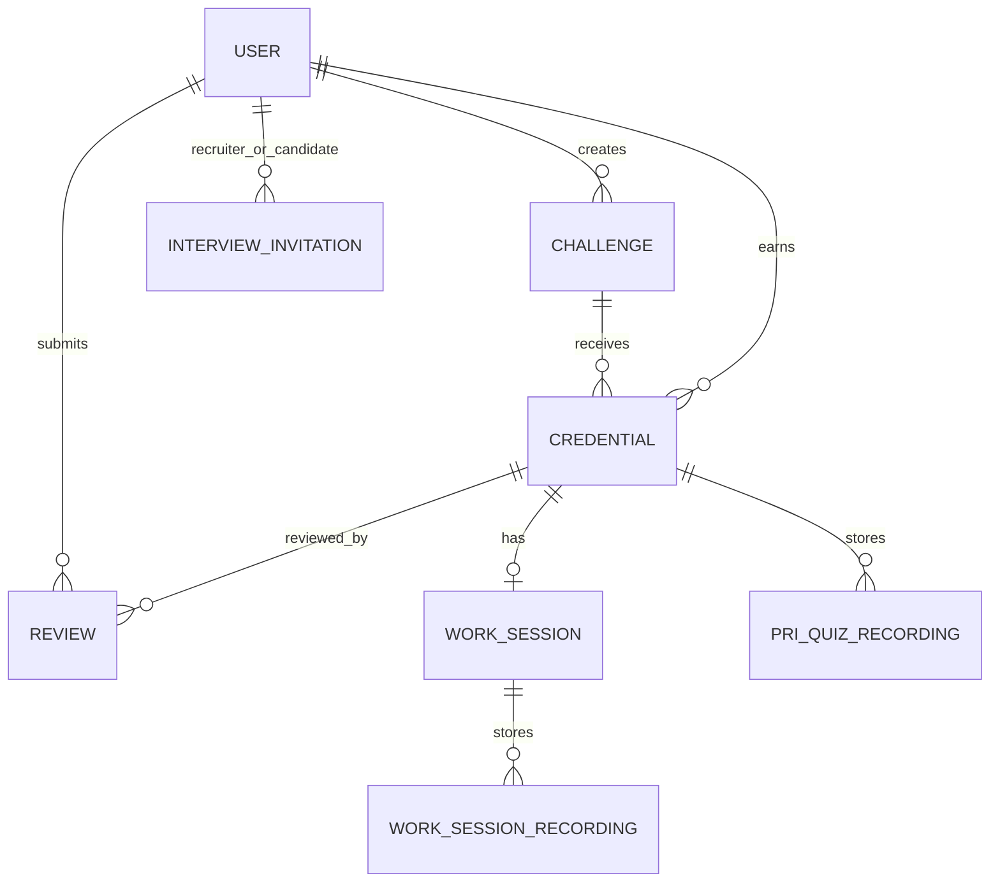

# Architecture

[← Back to README](../README.md)

## System Diagram

## Request Walkthrough: Challenge Submission

1. An authenticated developer selects an active challenge and submits a public GitHub repository URL, optionally starting a recorded work session.
2. The API checks the current user and challenge, stores the submission, and associates the work session when one exists.
3. GitHub API requests collect repository metadata, commits, languages, and a timeline. The timed-session workflow uploads recording segments to the application server.
4. Configured Gemini analysis receives bounded repository/recording evidence and returns an assessment; configured PRI questions and speaking rounds are completed as separate stages.
5. Two different reviewer accounts submit rubric scores. Credential verification and PRI state are updated from persisted assessment and review records.
6. The developer and authorized recruiter/reviewer views display the resulting evidence and scores; the CodePassport endpoint exposes the public credential view.

AI/provider failure can leave a saved submission without a finished analysis. The UI offers retry paths; it does not fabricate a successful score.

## Components

| Component | Responsibility | Technology | Code location |
|---|---|---|---|
| Role-based dashboards | Developer submissions/assessments, reviewer queue, recruiter discovery | React, Next.js | `src/app/page.js`, `src/app/components/` |
| API and authentication | Session checks, role-specific operations, validation and persistence | Next.js route handlers, NextAuth | `src/app/api/`, `src/lib/auth.js` |
| Persistence | Users, challenges, credentials, reviews, work sessions, invitations | Prisma; current local schema uses SQLite | `prisma/schema.prisma`, `src/lib/db.js` |
| GitHub evidence | Public repositories, commit history, language and timeline data | GitHub REST API / Octokit helpers | `src/app/api/github/`, `src/app/api/credentials/[id]/timeline/` |
| Assessment and scoring | Quiz/speaking/session evaluation, review rubric, PRI calculation | Application code + Gemini API | `src/lib/scoring.js`, `src/lib/challenge-scores.js`, `src/lib/session-evaluation.js` |
| Face presence signal | Client-side face count during monitored assessment; sends integrity events | MediaPipe Tasks Vision | `src/app/components/FaceMonitor.jsx` |
| Recording storage | Session and assessment recording segments | Local filesystem in development | `src/app/api/work-sessions/`, `src/app/api/credentials/` |

## Data Model

| Entity | Key fields | Notes |
|---|---|---|
| `User` | id, role, GitHub username, profile and PRI fields | Student, reviewer, or recruiter account |
| `Challenge` | title, role, difficulty, requirements, PRI configuration | Created by a recruiter |
| `Credential` | user/challenge, repository URL and SHA, quiz/speaking results, score, verification state | Unique per user/challenge/revision/mode |
| `Review` | reviewer, credential, five rubric scores, calculated score | One review per reviewer per credential; two distinct reviews required for verification |
| `WorkSession` | owner, challenge, elapsed time, repository, analysis and status | Optional recorded challenge session |
| `InterviewInvitation` | recruiter, candidate, challenge, scheduled time, duration, meeting link | Appears on the candidate dashboard |

## Key APIs

| Method | Endpoint | Purpose | Access |
|---|---|---|---|
| `GET` | `/api/candidates` | Search/filter developer profiles and public score summaries | Recruiter |
| `GET` | `/api/challenges` | List active challenges or recruiter-owned challenges | Authenticated, role-scoped |
| `POST` | `/api/challenges/:id/submissions` | Submit repository evidence for a challenge | Developer |
| `POST` | `/api/reviews` | Submit an independent rubric review | Reviewer |
| `POST` | `/api/github/analyze` | Analyze a developer's public GitHub evidence | Authenticated developer |
| `GET` | `/api/credentials/:id/timeline` | Return a credential repository timeline | Authorized viewer |
| `GET` | `/api/passport/:username` | Return a public CodePassport record | Public profile endpoint |
| `POST` | `/api/interview-invitations` | Schedule candidate interviews | Recruiter |

## Tech Stack

| Layer | Choice | Reason |
|---|---|---|
| Frontend | Next.js 14, React 18 | App Router UI and server API in one project |
| Backend | Next.js route handlers | Shares application models and authentication |
| Database | Prisma schema currently declares SQLite | Simple local development; hosted PostgreSQL configuration/migrations must be reconciled before relying on them |
| AI | Google Gemini API | Evidence-grounded repository/recording analysis and configured assessment generation; no model trained by the team |
| GitHub | GitHub REST API | Inspect public repository and contribution evidence |
| Face signal | MediaPipe Tasks Vision in browser | Local face presence/count signal; not identity recognition |
| Hosting | Local development confirmed; hosted deployment status needs team verification | Current submission documentation does not claim a working production URL |

## Data Sources

| Dataset | Source and licence | Real or synthetic | Used for |
|---|---|---|---|
| Repository metadata, commits, languages | Public repositories via GitHub REST API; repository terms apply | Real, user-submitted | Timeline and activity evidence |
| Challenge descriptions and submissions | Entered by platform users | Real user data | Assessment context and credential records |
| Recordings and assessment answers | Captured with participant consent | Real personal data | Session, quiz, and speaking review |
| AI assessment output | Gemini API response from submitted evidence | Generated | Coaching/review support; not a hiring decision |
